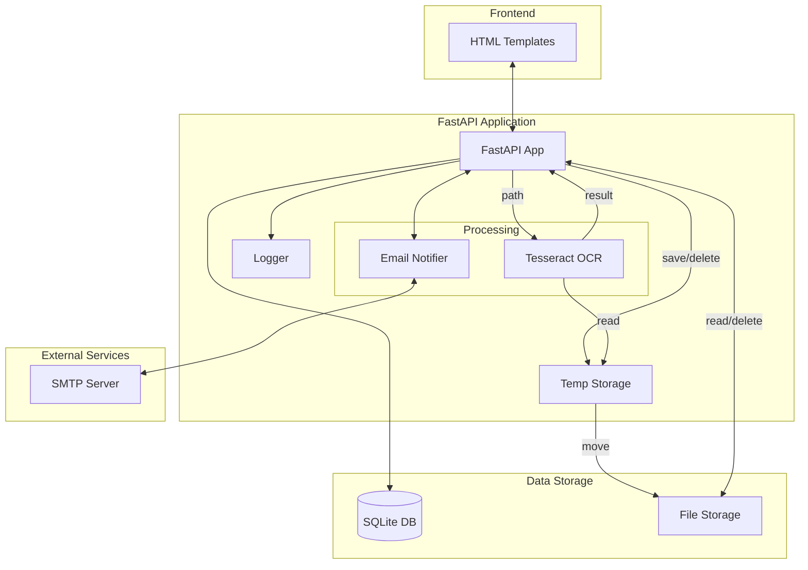
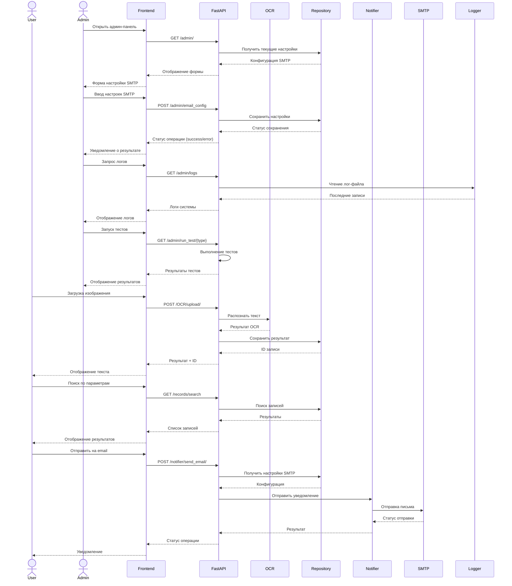

# Томский Государственный Университет
# КУРСОВОЙ ПРОЕКТ

**Предмет:** "Программирование на Python: углубленный курс"  
**Тема:** "Микросервис для анализа текста на изображениях (OCR)"  
**Выполнил:** Плотников Г.А. (g_plotnikov@mail.ru)  
**Дата:** 15.02.2025 г.

---

## 1. Обязательная часть:  
### 1.1. Этапы работа над проектом (общие для всех проектов).  
**Анализ требований:**  
• Определение функциональных требований (обработка изображений с распознаванием лиц).  
• Выбор технологии для распознавания лиц (например, OpenCV или Dlib).  
• Разработка API для получения изображений от пользователей.  
**Разработка backend:**  
• Создание FastAPI сервиса для приема и обработки изображений.  
• Реализация функционала для распознавания лиц с использованием библиотеки OpenCV.  
• Применение паттерна Singleton для управления моделью распознавания лиц.  
**Работа с базой данных:**  
• Проектирование структуры базы данных для хранения изображений и результатов распознавания. 
• Реализация CRUD операций для сохранения и извлечения данных.
**Тестирование и валидация:**  
• Тестирование работы сервиса с различными изображениями.  
• Валидация корректности данных, передаваемых через API  
**Документация и развертывание:**  
• Документирование API и сервиса  

### 1.2. Заданиe на курсовой проект:  
**Решаемые задачи:**   
• Использование библиотеки Tesseract для OCR.  
• Создание API с использованием FastAPI.  
• Валидация данных (Проверка, что изображение содержит текст).  
• Хранение результатов в базе данных и отображение их через frontend.  
Сервис организован на базе web фреймворка FastAPI и Tesseract.  

### 1.3. Инструкции преподавателя от 11.01.2025 (требования для всех проектов):
• **Описание в Readme (что за проект, для чего, как работает, как установить и запустить). - Выполнено**  
• **Использование паттернов программирования. - Выполнено: repository и notifier**  
• **Тестирование. - Выполнено**  
• **Разделение проекта, структурирование. - Выполнено**  
• **Валидация. - Выполнено**  
• **Шаблоны HTML (рекомендуется не менее 3). - Выполнено**  
• **Наследование шаблонов HTML от базового шаблона base.html - Выполнено**  
• Pandas, если есть смысл его использовать.  
• **Реализация API (чтобы можно было обратиться как с  помощью скрипта, так и со странички HTML). - Выполнено**  

### 1.4. Инструкции преподавателя к текущему проекту от 23.12.2024:
"Здравствуйте, в целом мне ваш проект понятен. Было бы здорово если бы вы описали несколько сценариев работы вашего проекта. Какие действия нужно совершить пользователю для решения задачи. 

Например, для распознавания тектса документа на русском языке пользользователь должен вполнить следующие действия:   
1.4.1. Авторизоваться/открыть сервис.  
1.4.2. Перейти на страницу загрузки документа для распознавания текста.
1.4.3. Загрузить документ с изображения в формате jpg.
1.4.4. Сервис сохраняет загруженный документ в директорию "temp".
1.4.5. Сервис выполняет проверку документа на корректность и в случае успеха запускает процесс распознавания текста.
1.4.6. В результате обработки документа пользователь получает на почту тестовый документ в формате ".docx" в котором находится распознанный текст загруженного документа.
1.4.7. Рекомендую добавить систему логирования чтоб администратор мог просматривать в виде таблицы статистику использования сервиса. Например, названия загруженных документов, размер документа, дату и время загрузки, время обработки документа, имя клиента и почту на которую был выслан результат."  

## 2. План работы ПО. Составлен исходя из анализа пунктов 1.1 - 1.4
#### Пользователи. Работа программы.
##### 2.1 Администратор
**2.1.1. Настройка SMTP для отправки email:**
• Заходит на страницу "АДМИН";
• Настраивает параметры SMTP сервера (сервер, порт, логин, пароль);
• Проверяет работу email через тестовую отправку со страницы "ПОИСК";

**2.1.2. Просмотр служебной информации администратором:**  
• Заходит на страницу "АДМИН";
• Просматривает логи системы (последние 100 записей);

**2.1.3. Запуск тестов:** 
• Заходит на страницу "АДМИН";
• Нажимает кнопку "Запуск тестов". Доступны следующие тесты:
    • OCR - проверка распознавания текста;
    • endpoints - проверка работы endpoints;
    • repository - проверка работы хранилища;
    • Все тесты - запуск всех тестов;
• Проверяет результаты тестов;

##### 2.2. Пользователь
**2.2.1. Распознование документа:**  
• Пользователь открывает главную страницу сервиса;
• Пользователь переходит на страницу загрузки документа для распознавания текста;  
• Пользователь загружает документ с изображения в формате jpg, jpeg, png, bmp, tiff;  
• Сервис сохраняет загруженный документ в директорию "temp";  
• Сервис выполняет проверку документа на корректность и в случае успеха запускает процесс распознавания текста;  
• При успешном распознавании текст отображается на странице, сохраняется в базу данных и файл перемещается в директорию repository/files;
• Пользователь может отправить результат распознавания на email;
• В случае ошибки распознавания отображается сообщение об ошибке, запись в базе данных не добавляется, файл удаляется из директории "temp".

**2.2.2. Просмотр документа:**  
• Пользователь переходит на страницу "ПОИСК";
• Может искать документы по тексту, имени файла или дате;
• Может просматривать исходные изображения;
• Может отправлять выбранные результаты на email;

**2.2.3. Удаление документов**  
• Пользователь переходит на страницу "ПОИСК";
• Пользователь выбирает файл/файлы для удаления и подтверждает удаление;  
• Сервис удаляет выбранные записи из базы данных и файлы из хранилища.

**2.2.4. Отправка результата на email:**  
• Пользователь переходит на страницу "ПОИСК";
• Пользователь выбирает распознанные данные для отправки на email;
• Сервис отправляет выбранные файлы на email пользователя.

## 3. Структура проекта
```
project_root/
├── app/                    # Основной код приложения
│   ├── main.py            # FastAPI приложение
│   ├── tesseract.py       # Модуль работы с OCR
│   ├── temp/             # Временное хранилище загруженных файлов
│   └── templates/         # HTML шаблоны
│       ├── base.html      # Базовый шаблон
│       ├── about.html     # Страница "О проекте"
│       ├── admin.html     # Админ-панель
│       ├── ocr.html       # Главная страница OCR
│       └── search.html    # Страница поиска
│
├── repository/            # Работа с базой данных
│   ├── repository.py     # CRUD операции
│   ├── files/           # Хранилище изображений
│   └── database.db      # SQLite база данных
│
├── notifier/             # Отправка уведомлений
│   └── notification_service.py  # Работа с SMTP
│
├── tests/               # Модульные тесты
│   ├── test_endpoints.py    # Тесты endpoints
│   ├── test_repository.py   # Тесты базы данных
│   ├── test_ocr_server.py   # Тесты OCR
│   ├── conftest.py          # Конфигурация тестов
│   └── tests_data/          # Тестовые файлы
│       ├── test_text_ok_ru.png     # Тест русского текста
│       ├── test_text_ok_en.png     # Тест английского текста
│       ├── test_no_letters.png     # Изображение без текста
│       ├── test_wrong_type.txt     # Неверный формат файла
│       └── test_empy_pict.png      # Пустое изображение
│
├── logs/                # Директория для логов
│   └── ocr_app_*.log   # Файлы логов
│
├── Tesseract-OCR/      # Папка с установленным Tesseract
├── logger_config.py    # Конфигурация системы логирования
├── requirements.txt    # Зависимости Python
└── README.md          # Документация проекта
```

## 4. Диаграмма компонентов


## 5. Диаграмма последовательностей


## 6. Установка программы Windows
5.1. Работа программы проверена на Python 3.12.6 и 3.13.0. 
5.2. Склонируйте файлы этого проекта в папку на компьютере. **Не используйте кириллицу в пути к папке.**  
5.3. Установите виртуальное окружениеие и зависимости. Запустите командную строку в скаченной папке проекта и выполните:  
• python -m venv env  
• env\Scripts\activate  
• pip install -r requirements.txt  
5.4. Скачайте инсталятор "tesseract-ocr-w64-setup-5.5.0.20241111.exe" с сайта:  
https://github.com/UB-Mannheim/tesseract/wiki  
5.5. Запустите инсталятор и в процессе установки выберите:  
• "Additional language data"(download) в меню "Компоненты устанавливаемой программы" выберите требуемые дополнительные языки (как минимум, русский) 
•  В меню "Выбор папки установки" выберите папку "Tesseract-OCR" которая находится в папке проекта  программы (см. пункт 5.2).   

## 7. Запуск программы  
Запустите командную строку в скаченной папке проекта и выполните:  
6.1. Активируйте витуальное окружение: Запустите командную строку в папке проекта и выполните env/Scripts/activate  
6.2. Запустите web-сервер, в виртуальном окружении выполните: uvicorn app.main:app  
6.3. Для работы с программой в браузере откройте http://127.0.0.1:8000 
6.4. Инструкции пользователю находятся на страницах "OCR" и "ПОИСК". На странице "О Проекте" есть примеры работы с API.

## 8. Паттерны программирования
В проекте используются следующие паттерны проектирования:

##### 8.1. Repository Pattern (repository/repository.py)
Абстрагирует работу с базой данных и предоставляет единый интерфейс для CRUD операций:
- add() - добавление новой записи
- get_all() - получение всех записей
- search_documents() - поиск по параметрам
- delete_by_id() - удаление записи
- save_email_settings() - сохранение настроек SMTP
- get_email_settings() - получение настроек SMTP

##### 8.2. Notifier Pattern (notifier/notification_service.py)
Абстракция для отправки уведомлений:
- configure_email() - настройка параметров SMTP
- notify_all() - отправка уведомления

## 9. Работа с микросервисом
##### 9.1. OCR
• **GET** /OCR/get_languages/ - Получение списка поддерживаемых языков
• **POST** /OCR/upload/ - Загрузка и распознавание файла

Примеры:
```bash
# Получение списка языков
curl http://localhost:8000/OCR/get_languages/

# Загрузка файла на распознавание
curl -F "file=@image.png" -F "lang=rus" http://localhost:8000/OCR/upload/
```

##### 9.2. Records (Записи)
• **GET** /records/ - HTML страница поиска записей
• **GET** /records/search - API для поиска записей
• **POST** /records/delete - API для удаления записей

Примеры:
```bash
# Получение всех записей
curl http://localhost:8000/records/search

# Поиск по тексту (с URL-кодированием для русских букв)
curl -G "http://localhost:8000/records/search" --data-urlencode "keyword=тест"

# Поиск по имени файла
curl "http://localhost:8000/records/search?filename=ok"

# Поиск по дате
curl "http://localhost:8000/records/search?date_to=2025-02-16"
```

##### 9.3. Email
• **POST** /notifier/send_email/ - Отправка текста на email

Пример:
```bash
# Отправка текста на email
curl -X POST http://localhost:8000/notifier/send_email/ -H "Content-Type: application/json" -d '{"text": "Текст для отправки", "to_email": "user@example.com"}'
```

##### 9.4. Логи
• **GET** /admin/logs - Получение логов системы

Пример:
```bash
# Получение последних 50 строк лога
curl http://localhost:8000/admin/logs?lines=50
```

##### 9.5. Тестирование
• **GET** /admin/run_test/{test_type} - Запуск тестов

Примеры:
```bash
# Запуск тестов OCR
curl http://localhost:8000/admin/run_test/ocr

# Запуск тестов endpoints
curl http://localhost:8000/admin/run_test/endpoints

# Запуск тестов repository
curl http://localhost:8000/admin/run_test/repository

# Запуск всех тестов
curl http://localhost:8000/admin/run_test/all
```

##### 9.6. Настройка SMTP
• **POST** /admin/email_config - Настройка SMTP сервера

Пример:
```bash
# Настройка SMTP
curl -X POST http://localhost:8000/admin/email_config -H "Content-Type: application/json" -d "{\"smtp_server\": \"smtp.mail.ru\", \"smtp_port\": 465, \"smtp_user\": \"your.login@mail.ru\", \"smtp_password\": \"your-app-password\", \"from_email\": \"your.login@mail.ru\"}"
```

## 10. Тестирование
В проекте есть 3 группы тестов:  

##### 10.1. Тесты endpoints (tests/test_endpoints.py):  
- Тесты HTML страниц:
    - GET /about/ - страница с описанием проекта  
    - GET /admin/ - страница администратора
    - GET / - страница OCR
- Тест API:
    - GET /records/search - доступность endpoint поиска записей

##### 10.2. Тесты базы данных (tests/test_repository.py):  
- Тесты репозитория:    
    - Тест добавления записи в БД
    - Тест удаления записи из БД

##### 10.3. Тесты OCR (tests/test_ocr_server.py):  
- Тесты распознавания разных типов файлов:
    - test_text_ok_ru.png: ожидается успешное распознавание русского текста
    - test_text_ok_en.png: ожидается успешное распознавание английского текста
    - test_no_letters.png: ожидается ошибка "текст слишком короткий или не содержит букв"
    - test_wrong_type.txt: ожидается ошибка "неправильный формат файла"
    - test_empy_pict.png: ожидается ошибка "текст слишком короткий или не содержит букв"  

**После каждого теста:**
    • Проверяется статус ответа
    • Сравнивается результат с ожидаемым
    • Очищаются тестовые данные из БД

##### 10.4. Запуск тестов:  
- Через веб-интерфейс на странице "АДМИН":  
    - По отдельности, выбрав нужный тест
    - Все вместе, нажав "Запустить все тесты"
- Через API микросервиса:
    - GET /admin/run_test/endpoints - запуск тестов endpoints
    - GET /admin/run_test/ocr - запуск тестов OCR
    - GET /admin/run_test/repository - запуск тестов repository
    - GET /admin/run_test/all - запуск всех тестов
- Из командной строки:
    - Все тесты: pytest
    - Конкретный тест: pytest tests/test_имя_файла.py

## 11. Валидация данных
В проекте используется Pydantic для валидации результатов OCR:

##### 11.1. Валидация результатов OCR (app/tesseract.py)
```python
class OCRResult(BaseModel):
    text: str
    status: bool = True
```

Валидация в методе ocr_recognize2() проверяет:
1. Корректность формата файла:
```python
try:
    img = PIL.Image.open(image_path)
except PIL.UnidentifiedImageError:
    return {"status": False, "text": "Ошибка: Неправильный формат файла"}
```

2. Валидация распознанного текста:
   - Не пустой (not recognized_text)
   - Содержит не менее 3 символов (len(recognized_text.strip()) < 3)
   - Содержит хотя бы одну букву (re.search('[a-zA-Zа-яА-Я]', recognized_text))

```python
if not recognized_text or len(recognized_text.strip()) < 3 or not re.search('[a-zA-Zа-яА-Я]', recognized_text):
    return {"status": False, "text": "Ошибка: Текст слишком короткий или не содержит букв"}
```

Если текст проходит валидацию, создается объект OCRResult, который гарантирует нужную структуру ответа:
- text: строка с распознанным текстом
- status: булево значение

